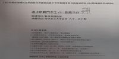

### 背景
本次研習由 110/02/01 至 110/02/05，在大雅區的[八十一木工場](https://zh-tw.facebook.com/81woodfan)進行。

### 目標
把一堆木片及角材，在五天之中做出一張桌子跟一個櫃子
### 桌面膠合
先把四片桌面木片選好要用的面及方向，開始雙面塗膠進行膠合，為了加強並上夾具。

### 桌腳刨平
桌腳四根角材先由老師刨出兩直角面，再由學員使用平刨機將四面刨光滑。
